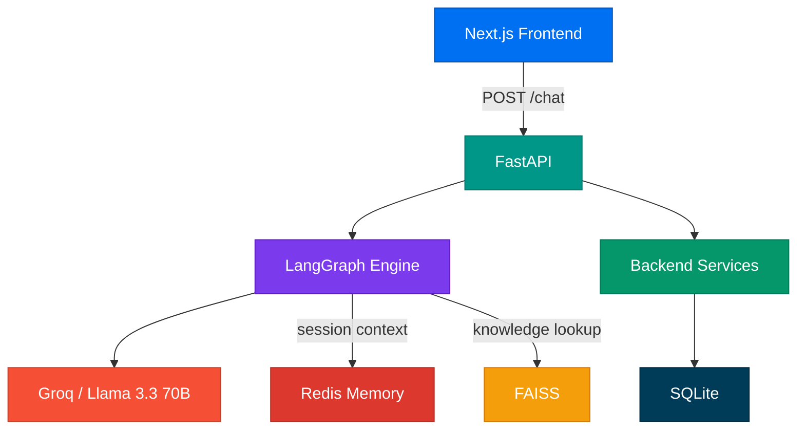
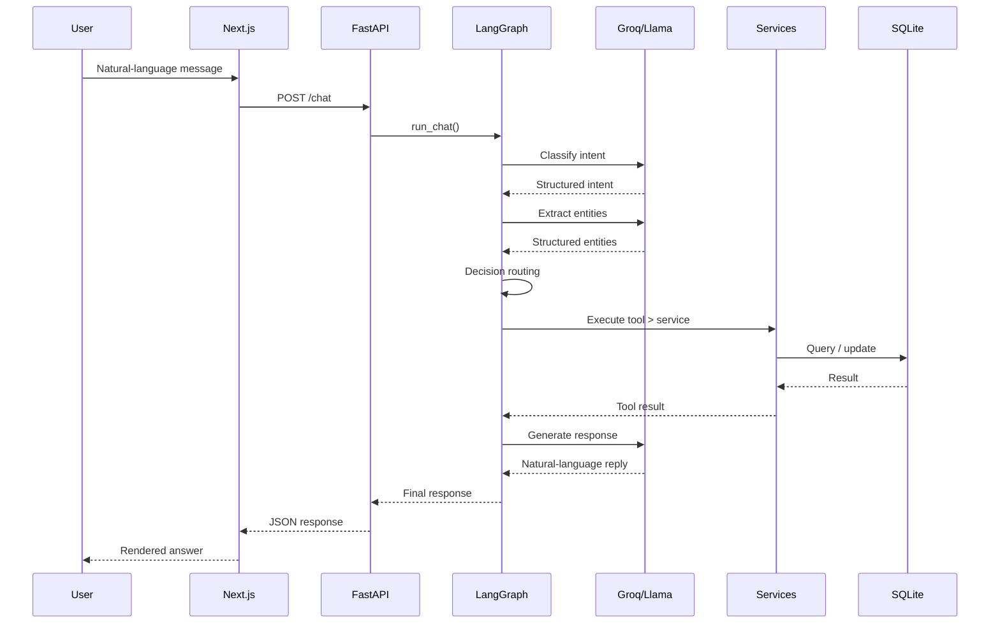
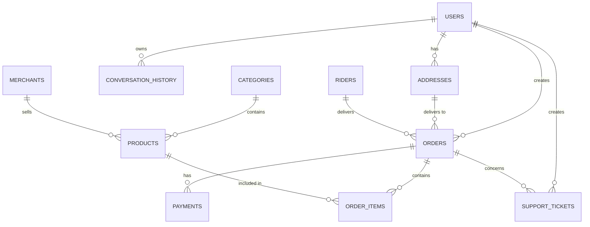

<p align="center">
  
  
  
  
  
  
</p>

# BuyQK AI

> **AI-powered commerce assistant** — combining LangGraph orchestration, Groq/Llama inference, and a FastAPI backend to deliver a conversational shopping experience.

BuyQK AI understands natural language, classifies user intent, extracts entities, executes backend operations, and responds conversationally — all while keeping the backend as the **single source of truth** for transactional data.

---

## What It Does

| Capability | Description |
|---|---|
| **Product Search** | Find products by name, category, or keyword |
| **Order Creation** | Place orders with product, quantity & address |
| **Order Tracking** | Check real-time status of existing orders |
| **Order Cancellation** | Cancel orders with backend confirmation |
| **Customer Support** | File support tickets for issues |
| **General Chat** | Natural conversation with context awareness |

---

## Tech Stack

### Frontend
- **Framework:** Next.js / React
- **State Management:** Zustand
- **Styling:** Vanilla CSS (Minimal, no external CSS frameworks)

### Backend
- **API Framework:** FastAPI (Python 3.11+)
- **ORM:** SQLAlchemy
- **Databases:**
  - **SQLite:** Transactional data (users, orders, products)
  - **Redis:** Short-term session and conversation memory
  - **FAISS:** Vector similarity search for Knowledge Base (RAG)

### AI & Orchestration
- **Workflow Orchestration:** LangGraph
- **LLM Integration:** LangChain
- **Inference Engine:** Groq (ultra-fast inference)
- **Model:** Llama 3 (e.g., Llama-3.1-8b-instant / Llama-3.3-70b-versatile)

---

## Architecture

### System Overview



### AI Workflow Pipeline

Every user message flows through a **5-node LangGraph pipeline**:


| Node | Purpose | Output |
|---|---|---|
| **Intent** | Classifies the message via LLM | `product_search`, `order_create`, `order_tracking`, `order_cancel`, `customer_support`, `general` |
| **Entity** | Extracts structured data via LLM | `product_name`, `quantity`, `order_id`, `address_id` |
| **Decision** | Deterministic routing logic | Selects which backend tool to execute |
| **Tool** | Executes the backend operation | Authoritative result from SQLite |
| **Response** | Converts result to natural language | User-facing conversational reply |

### Request Lifecycle



---

## Project Structure

```
buyqk-ai/
|
├── ai_engine/                        # AI orchestration layer
│   ├── graph/
│   │   ├── state.py                  # GraphState TypedDict
│   │   ├── builder.py                # LangGraph construction
│   │   └── runner.py                 # run_chat() entry point
│   ├── nodes/
│   │   ├── intent_node.py            # Intent classification (LLM)
│   │   ├── entity_node.py            # Entity extraction (LLM)
│   │   ├── decision_node.py          # Deterministic routing
│   │   ├── tool_node.py              # Backend tool execution
│   │   └── response_node.py          # Response generation (LLM)
│   ├── llm/
│   │   └── client.py                 # Centralized Groq/Llama config
│   ├── memory/
│   │   └── redis_memory.py           # Redis + in-memory fallback
│   ├── prompts/
│   │   └── system_prompt.txt         # Behavioral contract
│   └── tests/                        # AI-specific tests
│
├── backend/                          # FastAPI application
│   ├── api/
│   │   ├── chat.py                   # POST /chat endpoint
│   │   └── health.py                 # GET /health endpoint
│   ├── models/                       # SQLAlchemy ORM models (11 tables)
│   ├── schemas/                      # Pydantic request/response schemas
│   ├── services/
│   │   ├── product_service.py        # Product search & lookup
│   │   ├── order_service.py          # Order CRUD operations
│   │   └── support_service.py        # Support ticket operations
│   ├── database/
│   │   ├── sqlite.py                 # SQLite engine config
│   │   ├── dependencies.py           # FastAPI DB session dependency
│   │   ├── redis_client.py           # Redis connection helper
│   │   ├── vector_store.py           # FAISS vector store
│   │   └── init_db.py               # Table initialization
│   ├── tests/                        # Backend-specific tests
│   └── main.py                       # FastAPI app entry point
│
├── requirements.txt
├── .env                              # API keys (never commit)
├── .gitignore
└── README.md
```

---

## Data Layer

### Entity Relationships



### Data Infrastructure

| Store | Purpose | Scope |
|---|---|---|
| **SQLite** | Transactional data (users, orders, products, payments) | Persistent, authoritative |
| **Redis** | Short-term conversation/session memory | Ephemeral, session-scoped |
| **FAISS** | Vector similarity search for knowledge retrieval (RAG) | Knowledge base only |

> [!IMPORTANT]
> FAISS is **not** a transactional database. Redis is **not** a replacement for SQLite. Each store has a clearly separated responsibility.

---

## Setup

### Prerequisites

- **Python 3.11+**
- **Groq API key** — [console.groq.com](https://console.groq.com)
- **Redis** *(optional — in-memory fallback is automatic)*

### Installation

```bash
# Clone the repository
git clone https://github.com/Rohit1x52/BuyQK-Chatbot.git
cd BuyQK-Chatbot

# Create virtual environment
python -m venv .venv
.venv\Scripts\activate        # Windows
# source .venv/bin/activate   # macOS/Linux

# Install dependencies
pip install -r requirements.txt
```

### Environment Variables

Create a `.env` file in the project root:

```env
GROQ_API_KEY=your_groq_api_key_here
GROQ_MODEL=llama-3.3-70b-versatile
LLM_TEMPERATURE=0
LLM_MAX_TOKENS=1024
```

> [!CAUTION]
> Never commit your `.env` file. It is already included in `.gitignore`.

---

## Usage

### Start the Backend

```bash
cd backend
uvicorn main:app --reload
```

| Resource | URL |
|---|---|
| API Server | `http://127.0.0.1:8000` |
| Swagger Docs | `http://127.0.0.1:8000/docs` |
| Health Check | `http://127.0.0.1:8000/health` |

### API Endpoint

**`POST /chat`**

```json
{
  "message": "Find Amul milk",
  "user_id": 1,
  "session_id": "session-abc-123"
}
```

**Response:**

```json
{
  "session_id": "session-abc-123",
  "response": "I found Amul Toned Milk (1L) for ₹27. Would you like to order?",
  "intent": "product_search",
  "metadata": { "products": [...] }
}
```

---

## Testing

Run tests from the **project root**:

```bash
# Backend services
python -m backend.tests.test_services

# AI graph execution
python -m ai_engine.tests.test_graph

# Full AI + backend integration
python -m ai_engine.tests.test_integration

# Chat API end-to-end
python -m backend.tests.test_chat_api
```

**LLM tests** *(require a valid Groq API key — makes real API calls):*

```bash
python -m ai_engine.tests.test_llm
python -m ai_engine.tests.test_intent_llm
python -m ai_engine.tests.test_entity_llm
python -m ai_engine.tests.test_response_llm
```

---

## Design Principles

| Principle | Description |
|---|---|
| **Backend is the source of truth** | The LLM understands intent; the backend executes and validates. The AI never invents prices, stock, or order data. |
| **AI orchestrates, backend executes** | LangGraph controls *what* happens. Services determine *whether* and *how* it happens. |
| **Separation of concerns** | API routes → services → database. AI pipeline → tool node → services. No shortcuts. |
| **No hallucination** | If information is unavailable, the AI asks the user — it never fabricates data. |
| **Graceful degradation** | Redis unavailable? In-memory fallback. LLM API error? Deterministic keyword heuristics. |

---

<p align="center">
  <sub>Made by <strong>Rohit Ranjan Kumar</strong></sub>
</p>